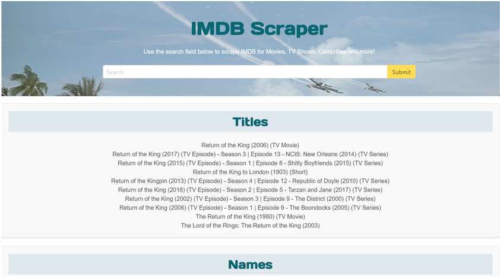

# IMDB Web Scraper

*This is a coding challenge that had the following guidelines:*
1. *Create a web crawler application using Node.js (preferred but not required to use Node) and/or any other languages/libraries that you choose.*
2. *The application front-end can be built using any language or framework you choose, but must be able to allow the user to enter a search term and to start the crawler application.*
3. *The crawler must be able to input content into an external search form on another site (like IMDB.com, dictionary.com, or a similar site), submit automatically and without user interaction (meaning that the application can "simulate" the click of the search button), and then scrape the content from the resulting screen.*
4. *When submitting the search, your crawler application needs to simulate a user inputting the text into the website's search field and "clicking" the search button.*

#### Technology Used:

`HTML 5` `CSS 3` `Node.js` `Express.js` `Vue.js` `Puppeteer` `Bulma CSS Framework`

## Instructions

1. To install locally, either clone this repository or download zip file.
2. `cd` into root of project.
3. `npm install`
4. `cd frontend`
5. `npm install`
6. `cd ..`
7. `npm start`
8. Then browse to `localhost:8080` in web browser.

***OR***

Go to Heroku hosted site: https://shielded-castle-10719.herokuapp.com/

